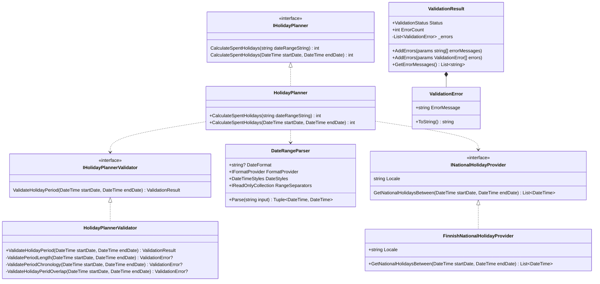

# Holiday Planner

- Code test for **Visma Solutions Oy** / **Visma Sign** fullstack developer role
- Implemented with C# and .NET 7
- Tested with Visual Studio 2022 on Windows 10
- Unit tests implemented with MSTestV2 and Moq

## Running the project

The project can be run in VS without any extra configuration. The program takes a date range as command-line arguments. The format is `dd.MM.yyyy - dd.MM.yyyy`. File **launchSettings.json** already has args for a default VS execution profile.

## Structure

The (mermaid) diagram below shows the class / interface structure of the project.

## Other notes

The project uses nullable reference type checks to prevent accidental null references and enforces these compiler warnings as errors. Thus, there aren't many null checks in code and for example null parameters aren't used in unit tests.

## Shortcomings and potential improvements

- `FinnishNationalHolidayProvider` can only handle Easter related holidays fpr years 2020-2024. More years could be added to the dictionary in the class that contains Good Friday dates or, more preferrably, a calculation would be used to determine the correct dates. The calculation wasn't implemented here since it's quite complicated.
- If the national holidays of more countries are taken into account in the future, it might be a good idea to separate certain holiday calculations/getters into an abstract class (used as base for implementations) or a separate utility class. E.g. Christmas and Easter are holidays in many countries and it would make very little sense to copy-paste the same code in different implementations of `INationalHolidayProvider`.
- `HolidayPlannerValidator` could take some of the currently constant variables (e.g. max period length) as parameters so that these would be configurable in the program (e.g. for implementations of different countries).
- `HolidayPlanner` currently only treats Sundays and national holidays as non-vacation consuming days. Other countries might have different rules (e.g. with Saturdays not consuming vacation days). It might be a good idea to make it possible to configure which days of the week consume vacation days in a future implementation.
- The current implementation has hard-coded error messages only in English. This was a conscious decicion since localzation wasn't mentioned in the spec. A proper implementation should consider translations for different languages.
- Error related classes `ValidationResult` and `ValidationError` are not "production-ready". They would likely need support (at least) for localization and error codes.
- A future implementation would likely benefit from the usage of custom exceptions. They were not used in this initial implementation due to time constraints and in order to keep the project simpler.
